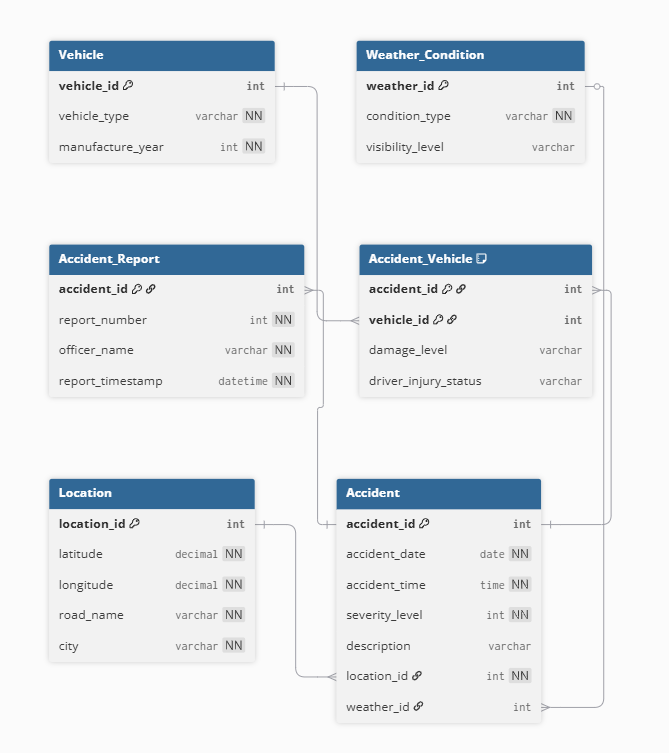

# Database ER Diagram

## Overview

This database models a transportation safety and accident risk analytics system. It tracks accidents, vehicles involved, weather conditions, and geographic locations to support hotspot detection, severity ranking, and spatial-temporal analysis.

## User Groups

- Traffic Safety Analysts
- City Transportation Planners
- Law Enforcement Agencies
- Public Safety Researchers

## Entity Summary

### Strong Entities
- Accident
- Location
- Weather_Condition
- Vehicle

### Weak Entity
- Accident_Report (dependent on Accident)

### Associative Entity
- Accident_Vehicle (resolves many-to-many between Accident and Vehicle)

## Relationship Types

- One-to-Many: Location → Accident
- One-to-One: Accident → Accident_Report
- Many-to-Many: Accident ↔ Vehicle (via Accident_Vehicle)

